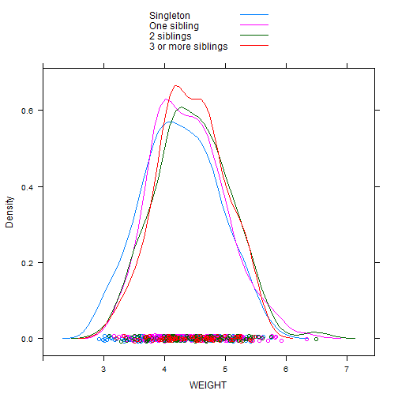
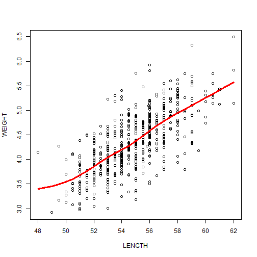

Project 1 AS 2014-2015: birthweight as fuction of parity and body length
==============================================================================
  
  <big>
  **Daphné RIMSKY-ROBERT and Pauline SMITH**  
  **27/01/15**
  </big>
  


library(knitr)
library(markdown)
knit("Markdown.Rmd", quiet=TRUE)
markdownToHTML("Markdown.md", "Markdown.html", option=c("highlight_code", "toc"), title="Simple R Markdown template")
browseURL("Markdown.html")


<h1> Importing data </h1>


```r
library(foreign)
library(lattice)
library(psych)
wd = "C:/Users/SexyManatee/Documents/GitHub/Rstat_projet"
# wd = 'D:/Documents/Etudes/ENS/M2/AS/AS_Cogmaster/R'

w <- read.spss(paste(wd, "01-weights.sav", sep = "/"), to.data.frame = TRUE)
names(w)
str(w)
```


<h1> Question 1 </h1>

### Numerical summary of sample size (frequencies and counts) according to parity

Creating functions to process data:

```r
# counts
func_count = function(x, digits = 1) round(length(x), digits = digits)

# frequencies
func_freq = function(x, digits = 1) round(length(x)/length(w$GENDER), digits = digits)
```


Processing data:

```r
# counts
d_count = aggregate(w$GENDER ~ PARITY, data = w, func_count)
names(d_count) = c("PARITY", "COUNT")

# frequencies
d_freq = aggregate(w$GENDER ~ PARITY, data = w, func_freq)
names(d_freq) = c("PARITY", "FREQUENCY")
```


Printing table for frequencies and counts:

```r
countfreq_summary = data.frame(d_count, d_freq[2])
print(xtable(countfreq_summary), type = "html", include.rownames = TRUE)
```

<!-- html table generated in R 3.1.1 by xtable 1.7-4 package -->
<!-- Wed Jan 28 11:57:35 2015 -->
<table border=1>
<tr> <th>  </th> <th> PARITY </th> <th> COUNT </th> <th> FREQUENCY </th>  </tr>
  <tr> <td align="right"> 1 </td> <td> Singleton </td> <td align="right"> 180.00 </td> <td align="right"> 0.30 </td> </tr>
  <tr> <td align="right"> 2 </td> <td> One sibling </td> <td align="right"> 192.00 </td> <td align="right"> 0.30 </td> </tr>
  <tr> <td align="right"> 3 </td> <td> 2 siblings </td> <td align="right"> 116.00 </td> <td align="right"> 0.20 </td> </tr>
  <tr> <td align="right"> 4 </td> <td> 3 or more siblings </td> <td align="right"> 62.00 </td> <td align="right"> 0.10 </td> </tr>
   </table>


### Numerical summary of baby weights according to parity

Creating function:

```r
func_weight = function(x, digits = 1) round(c(mean = mean(x), sd = sd(x), range = range(x)), 
    digits = digits)
```

Processing data:

```r
d_weight = aggregate(WEIGHT ~ PARITY, data = w, func_weight)
d_weight = as.data.frame(as.matrix(d_weight))
names(d_weight) = c("PARITY", "MEAN", "STAND DEV", "RANGE MIN", "RANGE MAX")
```

Printing table for baby weights:

```r
print(xtable(d_weight), type = "html", include.rownames = TRUE)
```

<!-- html table generated in R 3.1.1 by xtable 1.7-4 package -->
<!-- Wed Jan 28 11:57:35 2015 -->
<table border=1>
<tr> <th>  </th> <th> PARITY </th> <th> MEAN </th> <th> STAND DEV </th> <th> RANGE MIN </th> <th> RANGE MAX </th>  </tr>
  <tr> <td align="right"> 1 </td> <td> Singleton </td> <td> 4.3 </td> <td> 0.6 </td> <td> 2.9 </td> <td> 5.8 </td> </tr>
  <tr> <td align="right"> 2 </td> <td> One sibling </td> <td> 4.4 </td> <td> 0.6 </td> <td> 3.2 </td> <td> 6.3 </td> </tr>
  <tr> <td align="right"> 3 </td> <td> 2 siblings </td> <td> 4.5 </td> <td> 0.6 </td> <td> 3.1 </td> <td> 6.5 </td> </tr>
  <tr> <td align="right"> 4 </td> <td> 3 or more siblings </td> <td> 4.4 </td> <td> 0.5 </td> <td> 3.2 </td> <td> 5.5 </td> </tr>
   </table>

Density plot:

```r
densityplot(~WEIGHT, data = w, groups = PARITY, auto.key = TRUE)
```




<h1> Question 2 </h1>

### ONE-WAY ANOVA

```r
mod = aov(WEIGHT ~ PARITY, data = w)
print(summary(mod), type = "html", include.rownames = FALSE)
```

```
##              Df Sum Sq Mean Sq F value Pr(>F)  
## PARITY        3   3.48  1.1590   3.239 0.0219 *
## Residuals   546 195.36  0.3578                 
## ---
## Signif. codes:  0 '***' 0.001 '**' 0.01 '*' 0.05 '.' 0.1 ' ' 1
```

p < 0.03 : we reject the null hypothesis and conclude that there is a link between parity and baby weights.

### part of the variance explained
It is computed using the following formula:
 SS(effect)/ss(effect + residuals)

```r
part_explained = summary(mod)[[1]][["Sum Sq"]][1]/summary(mod)[[1]][["Sum Sq"]][2]
print(part_explained, type = "html", include.rownames = FALSE)
```

[1] 0.01779726
The part of the variance explained here is about 1.8%. 
### Assumptions
<ul>
<li><p>Independance</p>
<p>The sample includes less than 10% of the population and no obvious links are reported between the children. We can assume that the samples are independant.</p></li>
<li><p>Approximately normal</p>
<p>We need to compute a qqplot:</p></li>
</ul>

```r
qqnorm(w$WEIGHT)
```


It looks like a roughly linear function relates our sample distribution and the normal distribution, thus we can conclude that the sample distribution is approximately normal.

<ul>
<li>Constant variance</li>
</ul>

```r
bwplot(PARITY ~ WEIGHT, data = w, pch = "|")
```


According to what can be observed here and the data contained in the tables of question 1, it seems that the width of the boxes for each group is relatively constant, though "3 or more siblings" is slightly off.

<h1> Question 3 </h1>

### Aggregating the last two categories:

```r
levels(w$PARITY)[4] = levels(w$PARITY)[3]
levels(w$PARITY)[3] = "2 or more siblings"
```


### ONE-WAY ANOVA on new groups

```r
mod_2 = aov(WEIGHT ~ PARITY, data = w)
print(summary(mod_2), type = "html", include.rownames = FALSE)
```

```
##              Df Sum Sq Mean Sq F value  Pr(>F)   
## PARITY        2   3.45  1.7249   4.829 0.00834 **
## Residuals   547 195.39  0.3572                   
## ---
## Signif. codes:  0 '***' 0.001 '**' 0.01 '*' 0.05 '.' 0.1 ' ' 1
```
p< 0.01: we still reject the null hypothesis and conclude there is a link between parity and baby weights.


### part of variance explained

```r
part_explained_2 = summary(mod_2)[[1]][["Sum Sq"]][1]/summary(mod_2)[[1]][["Sum Sq"]][2]
print(part_explained_2, type = "html", include.rownames = FALSE)
```

```
## [1] 0.01765616
```
The part of the variance explained here is still about 1.8%.
### Assumptions
<ul>
<li><p>Independance</p>
<p>No changes in this assumption</p></li>
<li><p>Approximately normal</p>
<p>We need to compute a qqplot:</p></li>
</ul>

```r
qqnorm(w$WEIGHT)
```


No changes in this assumption
<ul>
<li>Constant variance</li>
</ul>

```r
bwplot(PARITY ~ WEIGHT, data = w, pch = "|")
```


According to what can be observed here and the data contained in the tables of question 1, it seems that the width of the boxes for each group is fairly constant. The assumption of constant variance is slightly better respected after aggregating the last two categories.

<h1> Question 4 </h1>

### Linear regression

```r
m = lm(w$WEIGHT ~ w$PARITY)
print(summary(m), type = "html", include.rownames = FALSE)
```

```
## 
## Call:
## lm(formula = w$WEIGHT ~ w$PARITY)
## 
## Residuals:
##      Min       1Q   Median       3Q      Max 
## -1.36107 -0.40888 -0.02382  0.41124  2.03893 
## 
## Coefficients:
##                            Estimate Std. Error t value Pr(>|t|)    
## (Intercept)                 4.25894    0.04455  95.605  < 2e-16 ***
## w$PARITYOne sibling         0.12975    0.06201   2.093  0.03685 *  
## w$PARITY2 or more siblings  0.19212    0.06318   3.041  0.00247 ** 
## ---
## Signif. codes:  0 '***' 0.001 '**' 0.01 '*' 0.05 '.' 0.1 ' ' 1
## 
## Residual standard error: 0.5977 on 547 degrees of freedom
## Multiple R-squared:  0.01735,	Adjusted R-squared:  0.01376 
## F-statistic: 4.829 on 2 and 547 DF,  p-value: 0.008339
```

p < 0.01: we reject the null hypothesis and conclude that there is a linear correlation between baby weight and parity. 

**R-squared** is a measure of the effect-size.

```r
print(summary(m)$r.squared, type = "html", include.rownames = FALSE)
```

```
## [1] 0.01734983
```
R-squared is close to 0, we can conclude that the correlation is low, even if present.


<h1> Question 5 </h1>

### Pairwise Pearson correlation
Correlations between baby weight, height, and head circumference, with Bonferroni correction:

```r
corr.test(as.matrix(w[2:4], adjust = "Bonferroni"))$r
```

```
##           WEIGHT    LENGTH     HEADC
## WEIGHT 1.0000000 0.7131192 0.6224651
## LENGTH 0.7131192 1.0000000 0.5982714
## HEADC  0.6224651 0.5982714 1.0000000
```
Value of t-tests for each correlation and associated p-values:

```r
corr.test(as.matrix(w[2:4], adjust = "Bonferroni"))$t
```

```
##          WEIGHT   LENGTH    HEADC
## WEIGHT      Inf 23.81266 18.61826
## LENGTH 23.81266      Inf 17.47821
## HEADC  18.61826 17.47821      Inf
```

```r
corr.test(as.matrix(w[2:4], adjust = "Bonferroni"))$p
```

```
##        WEIGHT LENGTH HEADC
## WEIGHT      0      0     0
## LENGTH      0      0     0
## HEADC       0      0     0
```
The p values indicated here are rounded to zero because they are all well under 0.05. All t-tests significantly indicate correlation.


Correlations between baby weight, height, and head circumference, without Bonferroni correction:

```r
corr.test(as.matrix(w[2:4], adjust = "none"))$r
```

```
##           WEIGHT    LENGTH     HEADC
## WEIGHT 1.0000000 0.7131192 0.6224651
## LENGTH 0.7131192 1.0000000 0.5982714
## HEADC  0.6224651 0.5982714 1.0000000
```
Value of t-tests for each correlation and associated p-values:

```r
corr.test(as.matrix(w[2:4], adjust = "none"))$t
```

```
##          WEIGHT   LENGTH    HEADC
## WEIGHT      Inf 23.81266 18.61826
## LENGTH 23.81266      Inf 17.47821
## HEADC  18.61826 17.47821      Inf
```

```r
corr.test(as.matrix(w[2:4], adjust = "none"))$p
```

```
##        WEIGHT LENGTH HEADC
## WEIGHT      0      0     0
## LENGTH      0      0     0
## HEADC       0      0     0
```
The p values indicated here are rounded to zero because they are all well under 0.05. All t-tests significantly indicate correlation.

### Scatterplot matrix of pairwise relationships

```r
splom(~w[2:4])
```


There seems to be a strong, positive correlation between all variables.
<h1> Question 6 </h1>
### Relationship between body length and weight, with a loess smoother

```r
lw1 <- loess(WEIGHT ~ LENGTH, data = w)
plot(WEIGHT ~ LENGTH, data = w)
j <- order(w$LENGTH)
lines(w$LENGTH[j], lw1$fitted[j], col = "red", lwd = 3)
```


The loess regression is not strictly a straight line, there seem to be some local non-linearities especially around low values.
Is a linear model then a good approximation for this set of data?


```r
WL.lm = lm(WEIGHT ~ LENGTH, data = w)
WL.res = resid(WL.lm)
plot(w$LENGTH, WL.res, ylab = "Residuals", xlab = "Fitted Values", main = "Linear Model Fitting")
abline(0, 0)
```


These residuals appear to indicate that a linear model is accurate in this case, and this is coherent with the high significance of correlation coefficients computed in Question 5.
We will thus rely on this linear model for the rest of our analysis.

### Table of regression coefficients from the linear model

```r
print(xtable(as.table(WL.lm$coefficients), type = "html", include.rownames = FALSE))
```

```
## % latex table generated in R 3.1.1 by xtable 1.7-4 package
## % Wed Jan 28 11:57:36 2015
## \begin{table}[ht]
## \centering
## \begin{tabular}{rr}
##   \hline
##  & x \\ 
##   \hline
## (Intercept) & -5.41 \\ 
##   LENGTH & 0.18 \\ 
##    \hline
## \end{tabular}
## \end{table}
```

### 95% confidence intervals for the slope parameter

```r
confint(WL.lm, "LENGTH", level = 0.95)
```

```
##            2.5 %    97.5 %
## LENGTH 0.1635992 0.1930164
```

### R-squared value for the linear model

```r
summary(WL.lm)$r.squared
```

```
## [1] 0.508539
```
A pseudo R-squared can also be calculated for the loess regression.

```r
ss.dist <- sum(scale(w$WEIGHT, scale = FALSE)^2)
ss.resid <- sum(resid(lw1)^2)
1 - ss.resid/ss.dist
```

```
## [1] 0.512096
```
We have now quantified the strong positive correlation observed in the scatterplot between body length and weight.
### Weight prediction for a height of 56.8 cm

```r
predict(WL.lm, data.frame(LENGTH = 56.8), interval = "confidence", level = 0.95)
```

```
##        fit      lwr      upr
## 1 4.715739 4.670117 4.761361
```
According to our linear model, a 56.8 cm tall baby would have a weight of 4716 grams, with a 95% confidence interval of 4670 grams to 4761 grams.

We can conclude that body length is a useful predictor for weight at 1 month of age, as these variables are very significantly correlated, and body length allows for a narrow prediction of body weight.
